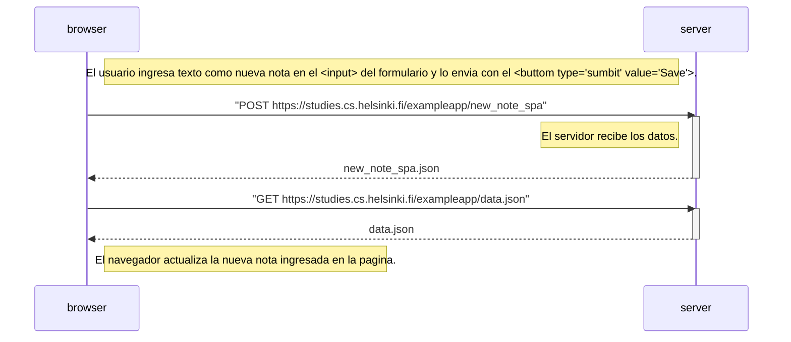

```mermaid
sequenceDiagram
    participant browser
    participant server

    Note right of browser: El usuario ingresa texto como nueva nota en el <input> del formulario y lo envia con el <buttom type="sumbit" value="Save">.

    browser->>server: "POST https://studies.cs.helsinki.fi/exampleapp/new_note_spa"
    activate server
    
    Note left of server: El servidor recibe los datos.
    
    server-->>browser: new_note_spa.json
    deactivate server
    
    browser->>server: "GET https://studies.cs.helsinki.fi/exampleapp/data.json"
    activate server
    server-->>browser: data.json
    deactivate server

    Note right of browser: El navegador actualiza la nueva nota ingresada en la pagina.
```